# Sequence Diagrams

## Назначение

Диаграммы описывают основные сценарии работы QuestEngine.
Диаграммы показывают бизнес-последовательность событий и не привязаны к конкретным REST endpoint, микросервисам или брокерам сообщений.

---

# 1. Создание Quest

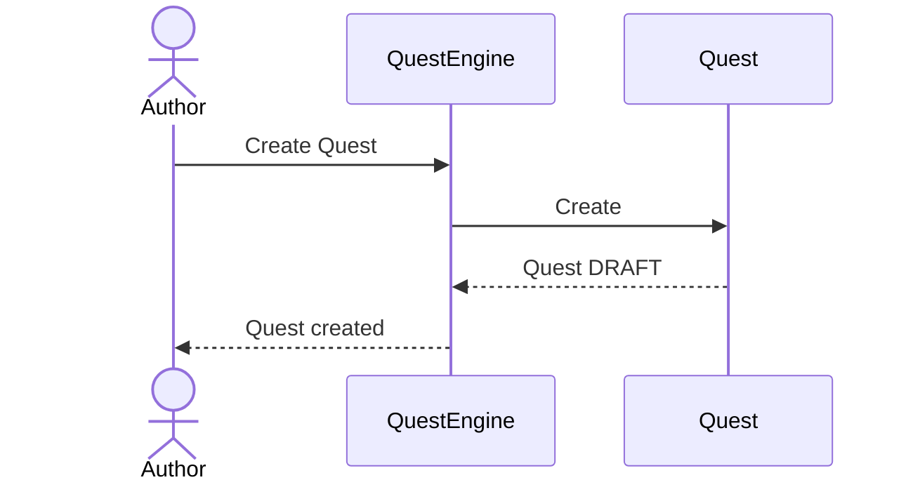

---

# 2. Подача заявки

Заявку подаёт капитан команды.

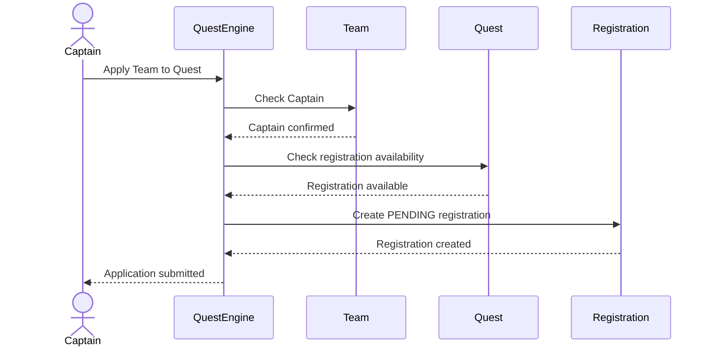

---

# 3. Подтверждение команды автором

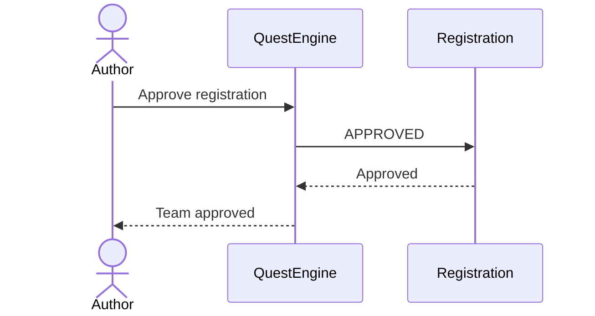

Подтверждение может произойти как до старта Quest, так и после его начала.

---

# 4. Старт Quest

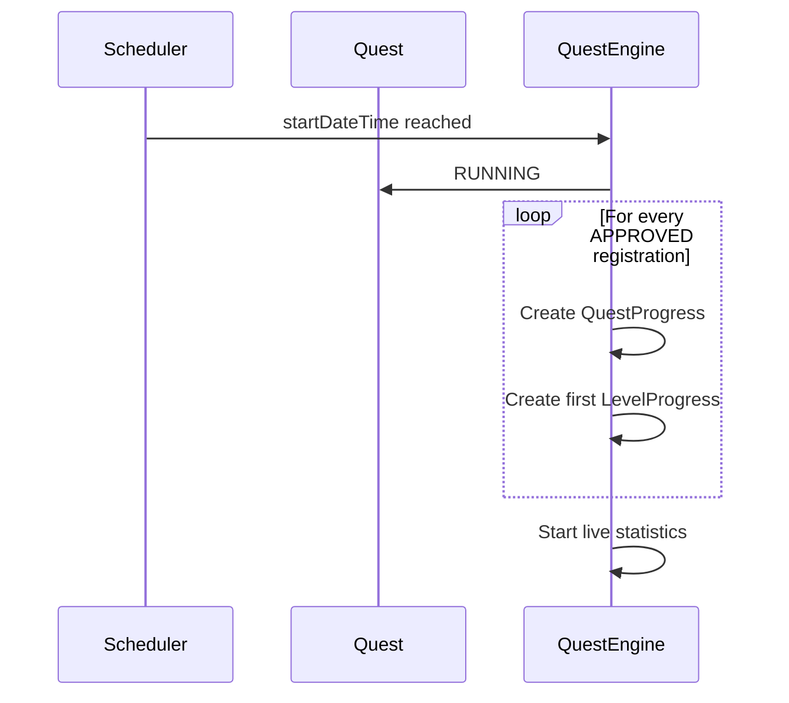

Игровое время начинает отсчитываться для всех участников одновременно.

---

# 5. Поздний вход команды

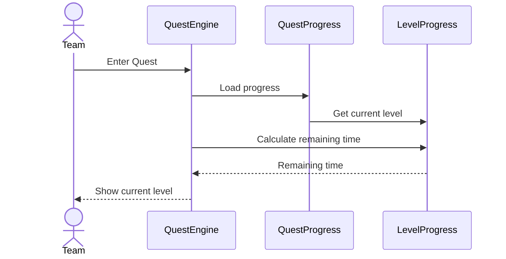

Время входа команды не изменяет время начала первого уровня.

---

# 6. Успешное прохождение уровня кодами

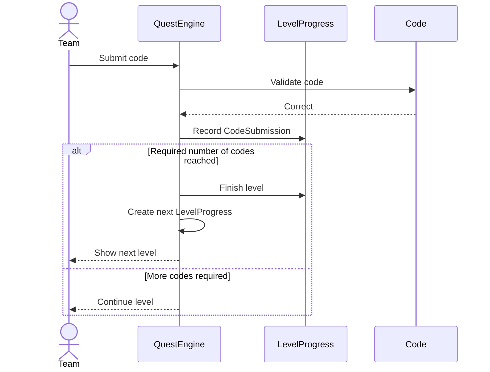

---

# 7. Неправильный код

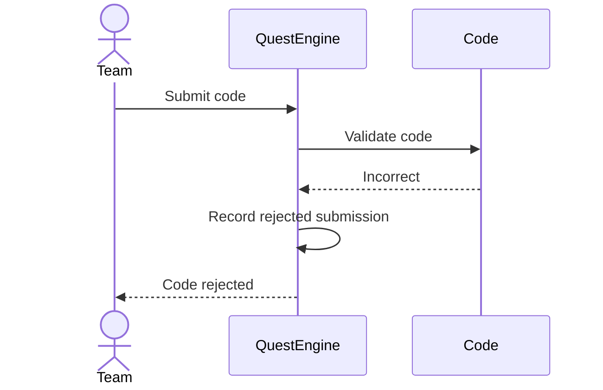

Неправильный код не завершает уровень.

---

# 8. Автопереход

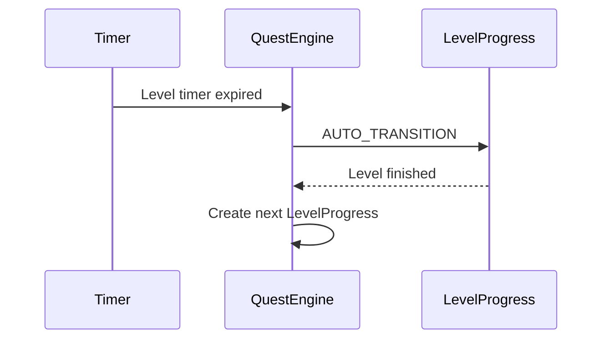

---

# 9. Подсказка

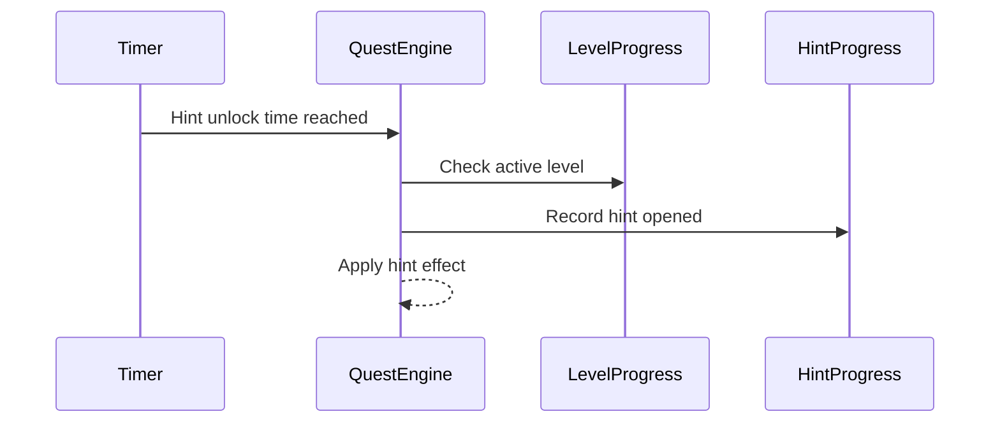

Подсказка открывается независимо для каждой команды.

---

# 10. Завершение Quest командой

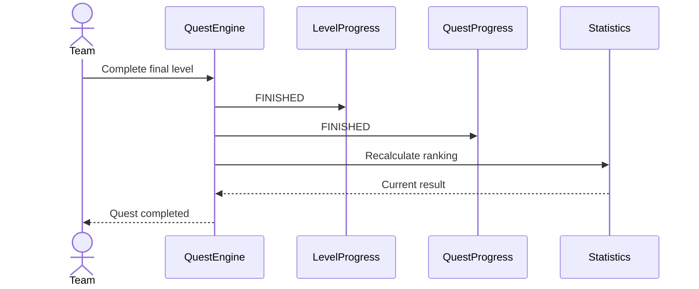

---

# 11. Принудительное завершение Quest автором

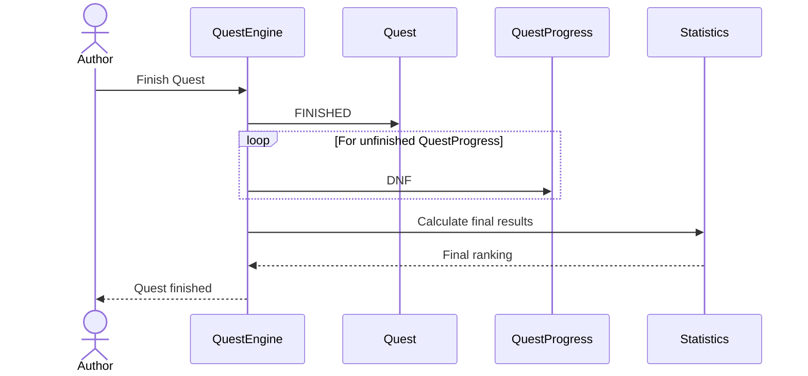

---

# 12. Общая последовательность игры

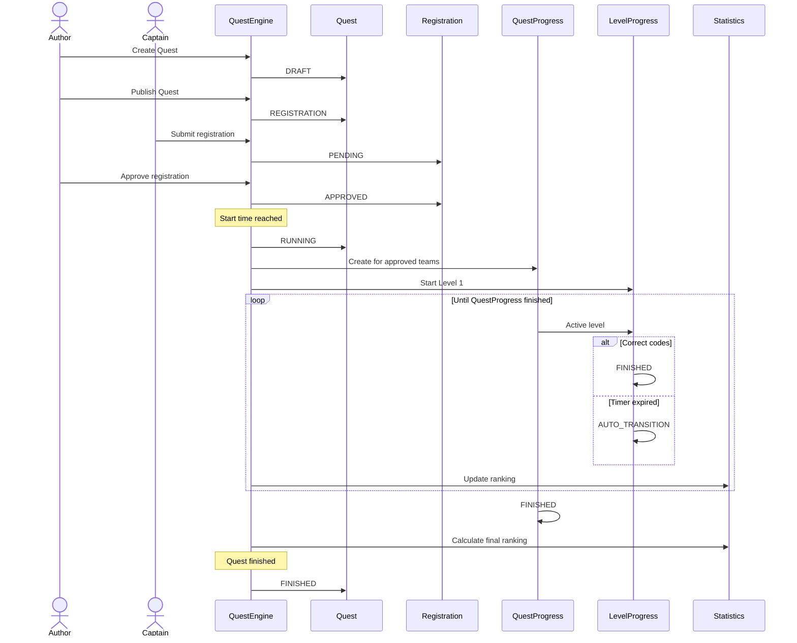

---

# Important runtime principle

Время начала Quest является общим для всех команд.

Время входа команды в Quest не является началом её игрового времени.

```text
Quest start
     │
     ├── Team A enters +10 sec
     │
     ├── Team B enters +5 min
     │
     └── Team C enters +30 min
```

Все команды участвуют в одном и том же соревновании и используют общий момент старта.

Разница во времени входа не должна создавать преимущества.

---

# Important isolation principle

Команды не взаимодействуют с runtime-состоянием друг друга.

```text
                 Quest
                   │
        ┌──────────┼──────────┐
        ▼          ▼          ▼
   QuestProgress QuestProgress QuestProgress
      Team A        Team B        Team C
        │             │             │
     Levels        Levels        Levels
```

Общее только описание Quest и правила игры.

Состояние прохождения полностью индивидуально.
