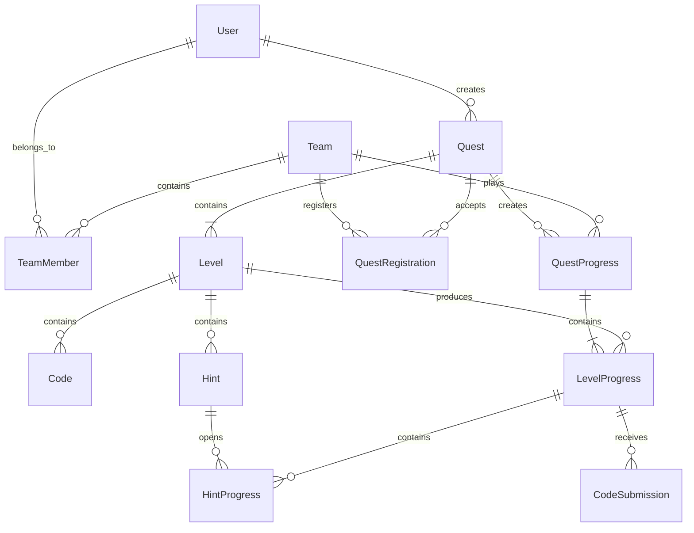

# Domain Model

## Overview
QuestEngine представляет собой движок проведения командных квестов.
Вся предметная область строится вокруг сущности `Quest`.
Автор создаёт Quest, команды подают заявки на участие, после старта Quest каждая команда получает собственный экземпляр прохождения (`QuestProgress`), который состоит из последовательности `LevelProgress`.

---

# Domain Diagram



---

# Runtime Model
Во время работы системы существует следующая цепочка.

```text
Author
        │
        ▼
Quest
        │
        ▼
QuestRegistration
        │
        ▼
QuestProgress
        │
        ▼
LevelProgress
        │
        ▼
Statistics
```

---

# Static Entities
Статические сущности описывают шаблон Quest.
Они создаются автором и не изменяются во время игры.

```
Quest
Level
Code
Hint
```

---

# Runtime Entities
Runtime-сущности существуют только во время проведения Quest.

```
QuestRegistration
QuestProgress
LevelProgress
CodeSubmission
HintProgress
```

---

# Quest
Quest является центральной сущностью предметной области (Core Domain Entity).

Quest описывает:
- автора;
- дату старта;
- дату окончания;
- правила;
- игровые уровни;
- зарегистрированные команды.

Quest не хранит состояние прохождения команд.

---

# QuestRegistration
QuestRegistration описывает намерение команды принять участие в Quest.
После подтверждения автором команда допускается к игре.

---

# QuestProgress
QuestProgress представляет прохождение Quest одной конкретной командой.
Каждая команда имеет собственный QuestProgress.
QuestProgress создаётся один раз и существует до окончания прохождения Quest.

---

# Level
Level является шаблоном игрового задания.
Каждый Quest состоит из упорядоченного списка Level.

---

# LevelProgress
LevelProgress представляет прохождение конкретного Level одной командой.

Он содержит:
- время открытия;
- время завершения;
- введённые коды;
- открытые подсказки;
- бонусы;
- штрафы;
- причину завершения.

---

# CodeSubmission
Каждая попытка ввода кода сохраняется отдельно.

Это позволяет:
- анализировать прохождение;
- строить статистику;
- искать ошибки игроков;
- предотвращать мошенничество.

---

# HintProgress
HintProgress фиксирует момент открытия подсказки конкретной команде.
Подсказки всегда открываются независимо для каждой команды.

---

# Statistics
Statistics не является самостоятельной сущностью базы данных.
Это вычисляемое представление (`View`) текущего состояния Quest.

Источник данных:
- QuestProgress
- LevelProgress
- Bonus Time
- Penalty Time

---

# Main Principles
## Quest — шаблон игры.
## QuestProgress — прохождение игры.

---

## Level — шаблон уровня.
## LevelProgress — прохождение уровня.

---

## Runtime никогда не изменяет шаблон.
Во время прохождения игры изменяются только Runtime-сущности.
Quest и Level остаются неизменными.

---

## Один Quest — множество QuestProgress.
Каждая команда проходит Quest независимо.
Игроки не влияют на Progress других команд.

---

## Один активный LevelProgress.
В каждый момент времени команда может иметь только один активный игровой уровень.

---

# Architecture Rule
Вся игровая логика работает исключительно через Runtime-сущности.
Изменение статических сущностей во время проведения Quest запрещено.
